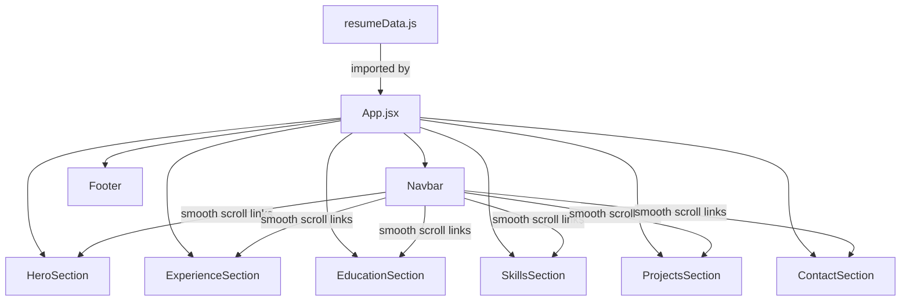

# Design Document: React Resume Website

## Overview

This design describes a single-page React application that renders a professional resume for Munagapati Mahesh Babu. The site is entirely data-driven: a single `resumeData.js` file holds every piece of content, and React components consume that data to render the UI. No backend is required; the app is a static site built with Vite + React.

Key design decisions:

- **Vite + React**: Fast dev experience, minimal config, aligns with the candidate's skill set.
- **Single data file**: All resume content lives in `src/data/resumeData.js`. Updating content never requires touching component code.
- **CSS Modules / plain CSS**: Keeps styling simple and avoids heavy dependencies. Tailwind CSS is an option given the candidate's familiarity, but plain CSS keeps the bundle minimal.
- **Smooth scroll via native CSS `scroll-behavior: smooth`**: No JS library needed.
- **Semantic HTML throughout**: Meets accessibility requirements without extra tooling.

## Architecture

The application follows a simple component-based architecture with no routing (single page) and no state management library (no global state needed).



Data flows one way: `resumeData.js` → `App.jsx` → individual section components via props. Each section component is a pure presentational component that receives its slice of data as props.

### Build & Deployment

- **Build tool**: Vite
- **Output**: Static HTML/CSS/JS bundle
- **PDF asset**: `public/Maheshbabu_Resume.pdf` served as a static file

## Components and Interfaces

### App (`src/App.jsx`)

Root component. Imports `resumeData` and distributes slices to child components.

```jsx
// Props: none (reads resumeData directly)
// Renders: Navbar, HeroSection, ExperienceSection, EducationSection, SkillsSection, ProjectsSection, ContactSection, Footer
```

### Navbar (`src/components/Navbar.jsx`)

```typescript
interface NavbarProps {
  ownerName: string; // Displayed as home link on the left
  sections: string[]; // List of section IDs for nav links, e.g. ["about", "experience", "education", "skills", "contact"]
}
```

- Fixed position at top of viewport (`position: sticky; top: 0`)
- Collapses to hamburger menu below 768px viewport width
- Each link scrolls to the corresponding `<section id="...">` element
- Hamburger toggle managed via local `useState`

### HeroSection (`src/components/HeroSection.jsx`)

```typescript
interface HeroSectionProps {
  name: string;
  title: string;
  summary: string;
  profilePhoto?: string; // Optional image URL
  resumePdfUrl: string; // Path to downloadable PDF
}
```

- Displays name (`<h1>`), title, summary paragraph
- Conditionally renders profile photo if provided
- "Download Resume" button linking to the PDF

### ExperienceSection (`src/components/ExperienceSection.jsx`)

```typescript
interface ExperienceEntry {
  jobTitle: string;
  company: string;
  location: string;
  startDate: string;
  endDate: string;
  responsibilities: string[];
  achievements?: string[];
}

interface ExperienceSectionProps {
  experiences: ExperienceEntry[];
}
```

- Renders entries in the order provided (data file stores them in reverse chronological order)
- Skips entries missing `jobTitle` or `company`
- Each entry shows title, company, location, dates, and a bulleted list of responsibilities/achievements

### EducationSection (`src/components/EducationSection.jsx`)

```typescript
interface EducationEntry {
  degree: string;
  institution: string;
  graduationYear: string;
  gpa?: string;
  honors?: string[];
  coursework?: string[];
}

interface EducationSectionProps {
  education: EducationEntry[];
}
```

- Renders entries in reverse chronological order
- Conditionally shows GPA, honors, coursework when present

### SkillsSection (`src/components/SkillsSection.jsx`)

```typescript
interface SkillCategory {
  category: string;
  skills: string[];
}

interface SkillsSectionProps {
  skillCategories: SkillCategory[];
}
```

- Renders each category with a heading and skill items
- Omits categories with empty `skills` arrays

### ProjectsSection (`src/components/ProjectsSection.jsx`)

```typescript
interface Project {
  title: string;
  description: string;
  techStack: string[];
  liveUrl?: string;
  githubUrl?: string;
}

interface ProjectsSectionProps {
  projects: Project[]; // Up to 3 projects
  maxProjects: number; // Default 3, controls how many card slots to show
}
```

- Renders up to `maxProjects` card slots (default 3)
- Filled projects show title, description, tech stack tags, and live/github links
- Empty slots render as "Coming Soon" placeholder cards
- Live links open in a new tab (`target="_blank" rel="noopener noreferrer"`)

### ContactSection (`src/components/ContactSection.jsx`)

```typescript
interface ContactSectionProps {
  email: string;
  phone: string;
  links: { label: string; url: string; icon?: string }[];
  resumePdfUrl: string;
}
```

- Email rendered as `mailto:` link
- Phone rendered as `tel:` link
- Social/professional links rendered as clickable icons/buttons
- Includes a second "Download Resume" button

### Footer (`src/components/Footer.jsx`)

Simple footer with copyright text. No props needed beyond the owner name.

## Data Models

### Resume Data File (`src/data/resumeData.js`)

A single default-exported JavaScript object:

```javascript
const resumeData = {
  personal: {
    name: "Munagapati Mahesh Babu",
    title: "Frontend Developer (Vue.js | React.js)",
    location: "Nellore, Andhra Pradesh, India",
    summary: "Frontend Developer with 2 years 10 months of experience...",
    profilePhoto: null, // optional
  },
  contact: {
    email: "[email]",
    phone: "[phone_number]",
    links: [
      {
        label: "LinkedIn",
        url: "https://linkedin.com/in/mahesh-babu-munagapati",
        icon: "linkedin",
      },
    ],
  },
  experience: [
    {
      jobTitle: "Associate Consultant – Frontend Developer",
      company: "Intellect Design Arena",
      location: "Product: Purple Fabric",
      startDate: "June 2023",
      endDate: "Present",
      responsibilities: [
        "Developed and maintained micro-frontend modules using Vue.js and Single-SPA",
        // ... more items
      ],
      achievements: [
        "On-the-Spot Award (2023-2024)",
        "Spot-Light Award (2024-2025)",
      ],
    },
  ],
  education: [
    {
      degree: "B.E.",
      institution: "Chennai Institute of Technology",
      graduationYear: "2019-2023",
      gpa: "9.1/10.0",
    },
  ],
  skills: [
    { category: "Languages", skills: ["JavaScript (ES6+)", "TypeScript"] },
    {
      category: "Frontend Frameworks",
      skills: ["Vue.js (2 & 3)", "React.js", "Single-SPA"],
    },
    {
      category: "UI Technologies",
      skills: ["HTML5", "CSS3", "Vuetify", "Tailwind CSS"],
    },
    {
      category: "State Management",
      skills: ["Pinia", "Vuex", "Redux Toolkit"],
    },
    {
      category: "Development Tools",
      skills: ["Vite", "Webpack", "Vitest", "Git", "GitHub", "GitLab", "Jira"],
    },
    {
      category: "Backend & APIs",
      skills: ["Node.js", "Express.js", "RESTful APIs", "SSE"],
    },
    { category: "Methodologies", skills: ["Agile", "Scrum", "CI/CD"] },
  ],
  projects: [
    {
      title: "VibeChatly",
      description:
        "A simple AI chat app built with React and Groq AI. Chat with AI, save conversations, and get instant responses.",
      techStack: [
        "React",
        "TypeScript",
        "Tailwind CSS",
        "Vite",
        "Groq API",
        "Llama 3.3 70B",
      ],
      liveUrl: "https://vibechatly.netlify.app/",
    },
    null, // placeholder for future project
    null, // placeholder for future project
  ],
  resumePdfUrl: "/Maheshbabu_Resume.pdf",
};

export default resumeData;
```

### Section Navigation Mapping

Derived at runtime in `App.jsx`:

```javascript
const sections = [
  "about",
  "experience",
  "education",
  "skills",
  "projects",
  "contact",
];
```

Each section component renders inside a `<section id="{sectionId}">` element, enabling anchor-based smooth scrolling from the Navbar.

## Correctness Properties

_A property is a characteristic or behavior that should hold true across all valid executions of a system — essentially, a formal statement about what the system should do. Properties serve as the bridge between human-readable specifications and machine-verifiable correctness guarantees._

### Property 1: Navbar renders links for all sections and owner name

_For any_ list of section IDs and any owner name string, the Navbar component should render exactly one navigation link per section ID and should display the owner name as text content.

**Validates: Requirements 1.1, 1.4**

### Property 2: Hero section renders all personal data fields

_For any_ non-empty name, title, and summary strings, the HeroSection component should render all three strings in its output.

**Validates: Requirements 2.1, 2.2, 2.3**

### Property 3: Conditional profile photo rendering

_For any_ HeroSection props, if `profilePhoto` is a non-null string then an `` element should be present in the output, and if `profilePhoto` is null or undefined then no `` element should be present.

**Validates: Requirements 2.4**

### Property 4: Experience entries render all fields

_For any_ list of valid experience entries (each having jobTitle, company, location, startDate, endDate, and at least one responsibility), the ExperienceSection should render every entry and each entry's output should contain its jobTitle, company, location, dates, and all responsibilities.

**Validates: Requirements 3.1, 3.2, 3.3**

### Property 5: Invalid experience entries are filtered out

_For any_ list of experience entries where some are missing `jobTitle` or `company`, the ExperienceSection should only render entries that have both fields present. The count of rendered entries should equal the count of valid entries in the input.

**Validates: Requirements 3.4**

### Property 6: Education entries render required fields

_For any_ list of education entries with degree, institution, and graduationYear, the EducationSection should render all entries and each entry's output should contain its degree, institution, and graduation year.

**Validates: Requirements 4.1, 4.2**

### Property 7: Optional education details render conditionally

_For any_ education entry, if `gpa` is provided then the rendered output should contain the GPA value, and if `gpa` is not provided then it should not render a GPA label. The same applies to honors and coursework arrays.

**Validates: Requirements 4.3**

### Property 8: Skill categories render with heading and items

_For any_ list of skill categories where each category has a non-empty `skills` array, the SkillsSection should render every category's name as a heading and every skill item within that category.

**Validates: Requirements 5.1, 5.2**

### Property 9: Empty skill categories are omitted

_For any_ list of skill categories where some have empty `skills` arrays, the SkillsSection should not render those empty categories. The count of rendered category headings should equal the count of categories with non-empty skills arrays.

**Validates: Requirements 5.3**

### Property 10: Project cards render with correct data and placeholder slots

_For any_ list of 0 to 3 project objects and a maxProjects value of 3, the ProjectsSection should render exactly `maxProjects` card slots. Filled projects should display their title, description, and tech stack. Empty slots should display placeholder content. Any project with a `liveUrl` should render a link with `target="_blank"`.

**Validates: Requirements 6.1, 6.2, 6.4, 6.5**

### Property 11: Contact links render with correct protocols

_For any_ email string, phone string, and list of social links, the ContactSection should render the email as an anchor with `href` starting with `mailto:`, the phone as an anchor with `href` starting with `tel:`, and each social link as an anchor whose `href` matches the provided URL.

**Validates: Requirements 7.1, 7.2, 7.3**

### Property 12: Resume data schema contains all required fields

_For any_ valid resumeData object, it must contain the top-level keys `personal`, `contact`, `experience`, `education`, and `skills`. The `personal` object must contain `name` and `title`. The `contact` object must contain `email` and `phone`. Each experience entry must have `jobTitle`, `company`, `startDate`, and `endDate`. Each education entry must have `degree`, `institution`, and `graduationYear`.

**Validates: Requirements 9.2**

### Property 13: All images have alt text

_For any_ rendered component tree that contains `` elements, every `` must have a non-empty `alt` attribute.

**Validates: Requirements 10.2**

### Property 14: Download button href matches PDF URL

_For any_ `resumePdfUrl` string, every download button/link in the HeroSection and ContactSection should have an `href` or `download` attribute that references the provided URL.

**Validates: Requirements 11.2**

## Error Handling

| Scenario                                                    | Handling                                                                                                                                                     |
| ----------------------------------------------------------- | ------------------------------------------------------------------------------------------------------------------------------------------------------------ |
| `resumeData.js` missing or malformed                        | Build will fail at import time. Vite reports the error during development. No runtime fallback needed.                                                       |
| Experience entry missing `jobTitle` or `company`            | Entry is silently omitted from the rendered list (Requirement 3.4).                                                                                          |
| Skill category with empty `skills` array                    | Category is silently omitted from the rendered list (Requirement 5.3).                                                                                       |
| Profile photo URL is null/undefined                         | `` element is not rendered. No broken image icon.                                                                                                       |
| Optional education fields (GPA, honors, coursework) missing | Corresponding UI elements are not rendered. No empty labels.                                                                                                 |
| PDF file missing from `public/`                             | Browser will show a 404 when the download link is clicked. The link itself still renders. Consider adding a check or fallback message in a future iteration. |
| Empty experience or education arrays                        | The section renders with just its heading and no entries. No crash.                                                                                          |

## Testing Strategy

### Testing Libraries

- **Unit / Component tests**: Vitest + React Testing Library (`@testing-library/react`)
- **Property-based tests**: `fast-check` (the standard PBT library for JavaScript/TypeScript)

### Unit Tests

Unit tests cover specific examples, edge cases, and integration points:

- Render the Navbar with known section data and verify link text and href values
- Render HeroSection with Mahesh Babu's actual data and verify content appears
- Render ExperienceSection with one valid and one invalid entry, verify only the valid one renders
- Render EducationSection with and without optional GPA field
- Render SkillsSection with a mix of populated and empty categories
- Render ContactSection and verify mailto/tel link formats
- Verify semantic HTML structure (header, nav, main, section, footer elements present)
- Verify heading hierarchy (h1 → h2 → h3, no skips)
- Verify download buttons appear in both HeroSection and ContactSection
- Verify keyboard navigation on interactive elements (tab index, role attributes)

### Property-Based Tests

Each property test uses `fast-check` with a minimum of 100 iterations and references its design property.

| Property    | Test Description                                                                                 | Tag                                                                                     |
| ----------- | ------------------------------------------------------------------------------------------------ | --------------------------------------------------------------------------------------- |
| Property 1  | Generate random section lists and owner names, render Navbar, assert all links present           | Feature: react-resume, Property 1: Navbar renders links for all sections and owner name |
| Property 2  | Generate random name/title/summary strings, render HeroSection, assert all appear                | Feature: react-resume, Property 2: Hero section renders all personal data fields        |
| Property 3  | Generate random props with/without profilePhoto, render HeroSection, assert img presence matches | Feature: react-resume, Property 3: Conditional profile photo rendering                  |
| Property 4  | Generate random valid experience lists, render ExperienceSection, assert all fields present      | Feature: react-resume, Property 4: Experience entries render all fields                 |
| Property 5  | Generate experience lists with some invalid entries, render, assert only valid ones appear       | Feature: react-resume, Property 5: Invalid experience entries are filtered out          |
| Property 6  | Generate random education lists, render EducationSection, assert required fields present         | Feature: react-resume, Property 6: Education entries render required fields             |
| Property 7  | Generate education entries with/without optional fields, assert conditional rendering            | Feature: react-resume, Property 7: Optional education details render conditionally      |
| Property 8  | Generate random skill categories with non-empty skills, render, assert headings and items        | Feature: react-resume, Property 8: Skill categories render with heading and items       |
| Property 9  | Generate skill categories with some empty, render, assert empty ones omitted                     | Feature: react-resume, Property 9: Empty skill categories are omitted                   |
| Property 10 | Generate random email/phone/links, render ContactSection, assert correct href protocols          | Feature: react-resume, Property 10: Contact links render with correct protocols         |
| Property 11 | Generate random resumeData objects, validate schema has all required fields                      | Feature: react-resume, Property 11: Resume data schema contains all required fields     |
| Property 12 | Render components with image data, query all img elements, assert non-empty alt                  | Feature: react-resume, Property 12: All images have alt text                            |
| Property 13 | Generate random PDF URLs, render Hero and Contact sections, assert download href matches         | Feature: react-resume, Property 13: Download button href matches PDF URL                |

Each property-based test MUST be implemented as a single `fc.assert(fc.property(...))` call with `{ numRuns: 100 }` minimum, and tagged with a comment in the format: `// Feature: react-resume, Property N: <title>`.
